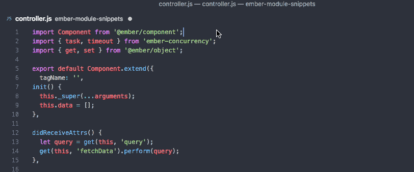

# ember-module-snippets

Snippets to make importing Ember modules a snap in VSCode.

## Usage

NOTE: The prefix to trigger these snippets has changed from `E.` to `E:` due to changes to the way VSCode deals with the "." character.

All of these snippets are preceeded by a `E:` (E-colon)

Where you might have in the past said `Ember.get`, with `ember-module-snippets` you can type `E:get` followed by `ctrl-space` to get these artisinal, grass-fed, snippets for Ember.js. Fuzzy matches work as expected (`E:bj` brings up `Ember.Object`, etc).

The [Ember.js Module Unification](https://github.com/emberjs/rfcs/blob/master/text/0143-module-unification.md) project is an important precursor to unlocking a good bit of future functionality.

The data for these snippets is based on: https://github.com/ember-cli/ember-rfc176-data The version of this extension is based on https://github.com/ember-cli/ember-rfc176-data/releases

And the raw json version: https://github.com/ember-cli/ember-rfc176-data/blob/master/mappings.json

Bonus Snippets:
`E:super` = `this._super(...arguments);`

Imports from `@ember/test-helpers`

## Running conversion script locally
1. Clone repo
1. `npm i`
1. `node converter.js`

## Installation

1. Install Visual Studio Code 1.10.0 or higher
2. Launch Visual Studio Code
3. From the command palette `ctrl-shift-p` (Windows, Linux) or `cmd-shift-P` (OSX)
4. Select `Install Extension`
5. Choose extension `ember-module-snippets`
6. Reload Visual Studio Code

## License

[MIT](https://raw.githubusercontent.com/candidmetrics/ember-module-snippets/master/LICENSE)